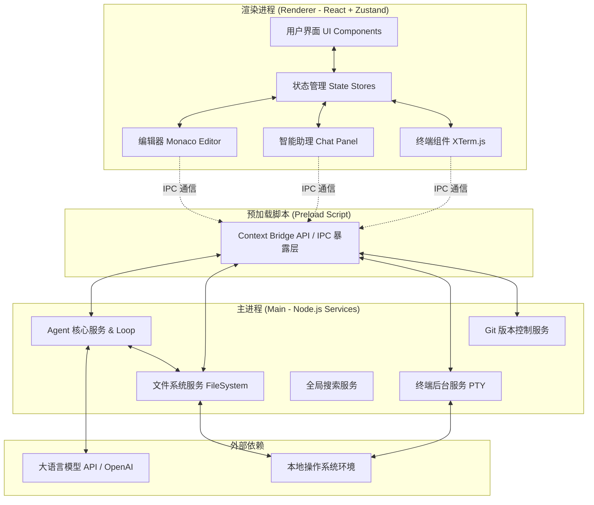
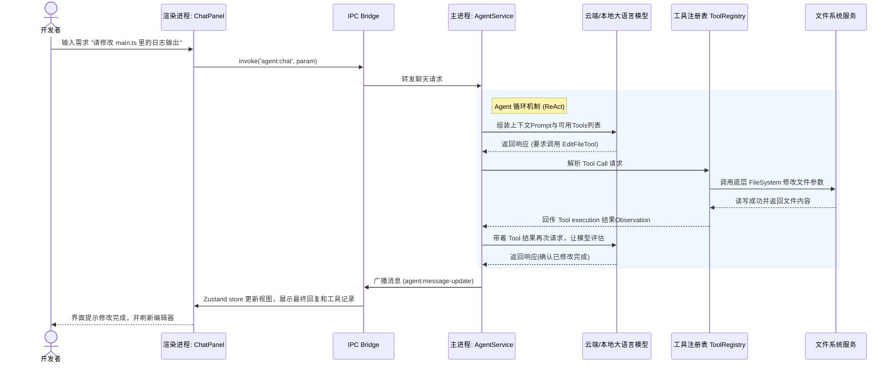
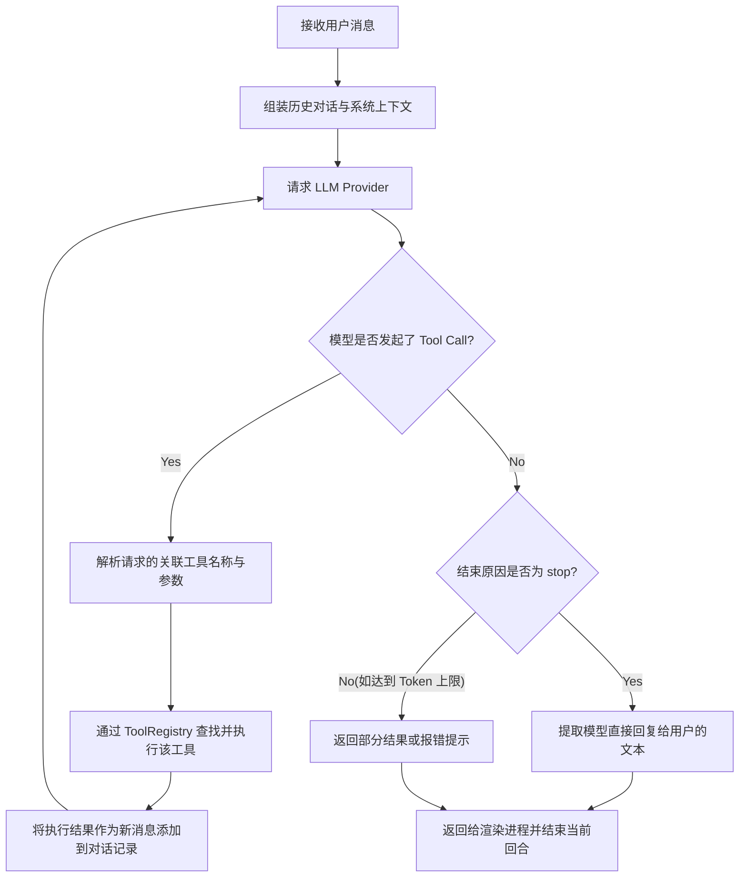
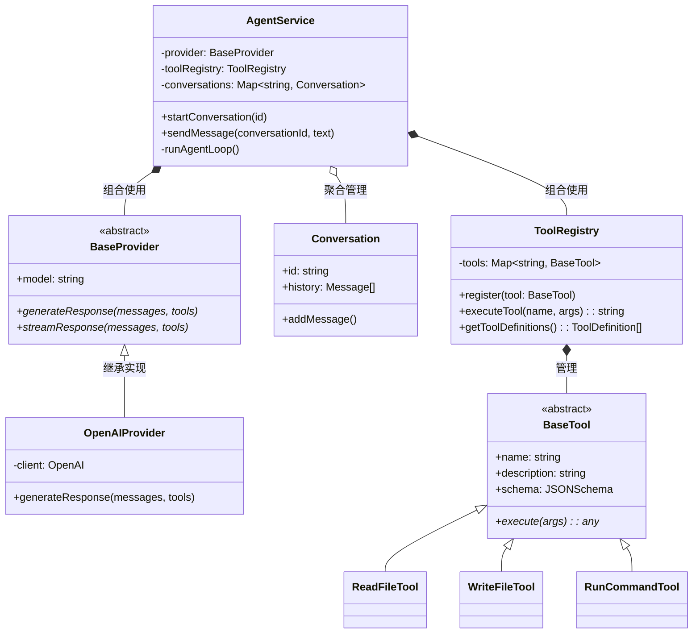

# 智能 Agent IDE 系统设计说明书

## 1. 系统体系架构 (System Architecture)

本项目基于 **Electron + React + Vite + TypeScript** 技术栈构建，采用了经典的多进程架构设计，将 UI 渲染与操作系统底层的重负载服务（如大语言模型通信、文件系统访问、终端执行）严格解耦。



**架构描述：**
- **渲染进程：** 负责界面呈现与用户交互，采用 React 组件化开发，Zustand 进行全局状态管理，基于 Monaco 提供专业的代码编辑体验。
- **IPC 层：** 严格控制安全边界，通过 `contextBridge` 注入受限且类型安全的 API，避免前端直接调用 Node.js 底层。
- **主进程：** 作为后端服务，挂载独立的 Service（文件管理、Git、终端等）。其中，`AgentService` 是智能体的核心，集成了模型调用与工具库映射（Tool Registry）。

---

## 2. 系统功能结构 (层次结构)

系统整体划分为六大核心模块：

- **编辑器模块 (Editor Module):** 多标签页代码编辑、基于 Monaco 的语法高亮与补全。
- **Agent 智能助手模块 (Agent AI Module):** 自然语言对话、上下文感知、基于大模型的多步推理工具调用、文档问答。
- **文件资源管理模块 (File Explorer Module):** 文件/文件夹树级展示、右键菜单操作（增删改查）。
- **版本控制模块 (Git Module):** 仓库状态查询、代码 Diff 预览、提交与同步（Commit/Push/Pull）。
- **终端仿真模块 (Terminal Module):** 内置命令行交互工具、底层子进程与伪终端（node-pty）绑定。
- **搜索模块 (Search Module):** 全局字符匹配查找与替换。

---

## 3. 系统用例的时序图 (Sequence Diagrams)

以下为您提供代表性的核心用例：**用户向 Agent 下达修改代码指令并自动应用**。



**时序图说明：**
整个交互采用了 **ReAct (Reason + Act)** 或 Function Calling 机制。用户不需要直接修改代码，Agent 会自动决定使用什么工具（如读取文件获取上下文、修改文件执行操作）。系统会持续在 主进程和 LLM 之间轮询通信，直至 LLM 认为任务完毕并给出最终的用户答复，然后一次性或流式发送回前端 UI。

---

## 4. 复杂功能的算法设计

系统中最为复杂的逻辑在于 **Agent Loop（智能体循环）**，用于处理复杂的需要多步工具调用的任务。

### 算法流程图


### 控制算法伪码

```python
def run_agent_loop(user_input, chat_history):
    # 初始化当前对话的上下文
    messages = chat_history.copy()
    messages.append({"role": "user", "content": user_input})
    tools = ToolRegistry.get_all_tools()
    
    max_iterations = 10
    current_iteration = 0
    
    while current_iteration < max_iterations:
        # 1. 思考推理 (Reasoning)
        response = provider.generate(messages, tools)
        messages.append(response.assistant_message)
        
        # 2. 判断是否只需对话无工具调用
        if not response.tool_calls:
            break
            
        # 3. 动作执行 (Acting)
        for tool_call in response.tool_calls:
            tool_impl = ToolRegistry.find(tool_call.name)
            try:
                # 4. 观察结果 (Observation)
                result = tool_impl.execute(tool_call.args)
                messages.append({
                    "role": "tool", 
                    "tool_call_id": tool_call.id, 
                    "content": result
                })
            except Exception as e:
                messages.append({
                    "role": "tool",
                    "content": f"工具执行失败: {e}"
                })
        
        current_iteration += 1

    return messages
```

---

## 5. 面向对象方法类图的详细设计

此处的类图主要针对主进程中的 `Agent` 与 `Tools` 模块的类群设计。



---

## 6. 接口设计

主要包含 Electron 的 IPC 双向通信接口，此处定义前后台契约 (IPC Channels) 设计规范。

### 6.1 Agent 相关接口
- `invoke('agent:send-message', { conversationId, content })`: 向指定对话发送新请求。
- `on('agent:typing', (data))`: 监听模型逐字输出数据的流式返回。
- `on('agent:tool-call', (data))`: 监听 Agent 正在调用工具的中间状态，用于在 UI 显示“正在读取xxx文件”。

### 6.2 File System 相关接口
- `invoke('fs:read', { path }): Promise<string>`
- `invoke('fs:write', { path, content }): Promise<boolean>`
- `invoke('fs:list', { path }): Promise<FileTreeItem[]>`

### 6.3 Editor / Terminal 接口
- `invoke('terminal:create', { cwd }): Promise<TerminalID>`
- `invoke('terminal:write', { id, input })`
- `on('terminal:data', { id, data })`

---

## 7. 数据库物理设计

本项目核心是一个 IDE 模型工具框架，通常采用**纯本地存储方案**，依赖本机的磁盘进行状态保留，不涉及复杂的关系型服务端 DB。
- **用户配置 (Settings) & 工作空间状态：** 采用基于本地的 JSON 格式或 Zustand 结合 `localStorage` / IndexedDB 进行轻量级序列化保存。
- **对话历史与缓存 (Chat History)：** 默认可基于 SQLite（如本地的 `sqlite3` 驱动）或 JSON Line 临时存储在操作系统的 userdata 路径（如 `~/.my-agent-ide/conversations.db`）。包含表结构：
  - `conversations (id VARCHAR PK, title VARCHAR, created_at DATETIME, workspace_path VARCHAR)`
  - `messages (id VARCHAR PK, conversation_id VARCHAR FK, role VARCHAR, content TEXT, timestamp DATETIME)`

---

## 8. UI（界面）设计

整个 IDE 的骨架（UI 布局）设计灵感来源于 VS Code 和 Cursor，呈现明显的分区格局。

### 8.1 空间布局
1. **左侧边栏 (Sidebar - ~250px 宽):**
   - 顶部提供活动栏（Activity Bar）用以切换不同的 Panel：资源管理器（Explorer）、搜索（Search）、版本控制（Git/SCM）。
   - 中间部分利用 Tree View 展示具体列表。
2. **中心编辑区 (Editor Area - 弹性和主体部分):**
   - 顶部为标签栏 (Tab Bar)，提供多文档的打开。
   - 占据画面最大空间的是基于 Monaco 的富代码编辑框，支持行号、语法高亮与右键代码动作。
3. **右侧面板 (Agent Chat - ~300px 宽):**
   - 上半部分：滚动的对话视图 (Chat Messages)，渲染 Markdown 文本，展示代码块以及带状态的 Tool Call 动作折叠面板（“正在读取文件...” “已执行终端命令...”）。
   - 下半部分：用户输入框组件 (Chat Input)，可支持提及（@ 文件），底部有发送和中断按钮。
4. **底层控制台区 (Terminal Area - 可折叠区):**
   - 分为集成终端、输出、调试台等 Tab 页。
5. **底侧状态栏 (Status Bar - 24px 高):**
   - 提供当前光标行列信息、当前 Git 分支、项目环境、系统忙闲状态反馈。

### 8.2 交互响应要求
- **拖拽控制：** 左、下、右各个面板的边界须支持通过拖拽控制分隔器 (Divider/SplitPane) 调整宽度和高度。
- **夜间模式：** 全局支持基于 CSS 变量的深色/浅色主题 (Dark/Light mode) 的一键无缝切换。
- **快捷键绑定：** 例如 `Cmd/Ctrl + L` 即可唤起或聚焦到右侧 AI Chat Input 框。
